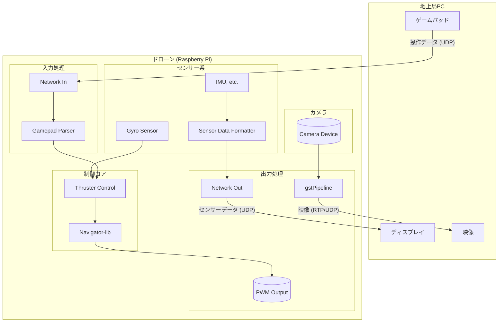

# アプリケーションアーキテクチャ解説

このドキュメントは `ws3 - Navigator Control System` の内部構造、データフロー、および各コンポーネントの役割について解説します。

## 1. 概要

このアプリケーションは、遠隔地のPC（地上局）からゲームパッドの操作情報を受信し、水中ドローンのスラスターをリアルタイムに制御します。同時に、ドローンに搭載された各種センサー（IMU、気圧、水温など）の情報を地上局へ送信し、カメラ映像をGStreamer経由でストリーミング配信します。

主な特徴は以下の通りです。

-   **UDPによる低遅延通信:** ゲームパッド操作とセンサーテレメトリの送受信。
-   **モジュール化された設計:** 各機能（ネットワーク、スラスター制御、センサー）が独立したファイルに分割されており、保守と拡張が容易です。
-   **設定ファイル (`config.ini`) による柔軟なカスタマイズ:** PWMの範囲、ネットワークポート、制御ゲインなどをソースコードの変更なしに調整可能です。
-   **リアルタイム設定同期:** 地上局アプリケーションから `config.ini` を遠隔で更新し、即座に動作へ反映させる仕組みを持ちます。
-   **GStreamerによる映像配信:** 複数のカメラ映像を効率的にネットワーク配信します。
-   **フェイルセーフ機構:** 通信が途絶えた場合にスラスターを安全に停止します。

## 2. アーキテクチャ図

## 3. 主要コンポーネント解説

### 3.1. `main.cpp`

アプリケーションのエントリーポイントであり、全体の処理フローを管理する心臓部です。

-   **初期化:**
    -   `loadConfig()` を呼び出し、`config.ini` から設定を読み込みます。
    -   `ConfigSynchronizer` スレッドを開始し、設定の遠隔更新待機を開始します。
    -   `network_init()` でUDPソケットを準備します。
    -   `thruster_init()` でPWM出力を有効化します。
    -   `start_gstreamer_pipelines()` でカメラ映像の配信を開始します。
-   **メインループ:**
    -   **設定更新チェック:** `g_config_updated_flag` を確認し、設定が更新されていれば `loadConfig()` で再読み込みします。
    -   **通信タイムアウト監視:** 地上局からのデータが一定時間途絶えていないかチェックし、タイムアウトした場合はフェイルセーフモードに移行します。
    -   **データ受信:** `network_receive()` で地上局からゲームパッドデータを受信します。
    -   **データパース:** `parseGamepadData()` で受信した文字列を `GamepadData` 構造体に変換します。
    -   **制御更新:** `thruster_update()` を呼び出し、最新のゲームパッド情報とジャイロセンサーの値を基に、各スラスターの目標PWM値を計算し、出力します。
    -   **センサーデータ送信:** 一定間隔（`config.ini`で設定）で `read_and_format_sensor_data()` を呼び出し、センサー情報を文字列化して `network_send()` で地上局に送信します。
-   **クリーンアップ:**
    -   ループ終了後、`thruster_disable()` や `network_close()` などを呼び出し、リソースを安全に解放します。

### 3.2. `config.cpp` / `config.h`

`config.ini` ファイルの読み込みと、アプリケーション全体で利用される設定値の管理を担当します。

-   `AppConfig` 構造体: すべての設定値を保持します。デフォルト値がコンストラクタで定義されており、`config.ini` が存在しない場合でも動作します。
-   `g_config`: `AppConfig` のグローバルインスタンス。どこからでも `g_config.pwm_min` のようにアクセスできます。
-   `loadConfig()`: `config.ini` をパースし、`g_config` の値を更新します。

### 3.3. `network.cpp` / `network.h`

地上局とのUDP通信を抽象化します。

-   `network_init()`: 受信・送信用のソケットを作成し、受信ポートをバインドします。受信ソケットはノンブロッキングに設定されます。
-   `network_receive()`: 地上局からのデータを受信します。`config.ini` で指定された `client_host` 以外からのパケットは破棄するセキュリティ機能があります。
-   `network_send()`: センサーデータなどを地上局に送信します。送信先IPアドレスは、最初にデータを受信したクライアントのIPアドレスに自動で設定されます。

### 3.4. `gamepad.cpp` / `gamepad.h`

地上局から送られてくるゲームパッドのデータ文字列をパース（解析）します。

-   `GamepadData` 構造体: スティックのXY軸、トリガー、ボタンの状態を保持します。
-   `parseGamepadData()`: `"LX,LY,RX,RY,LT,RT,Buttons"` という形式のカンマ区切り文字列を `GamepadData` 構造体に変換します。

### 3.5. `thruster_control.cpp` / `thruster_control.h`

最も複雑なロジックを持ち、ゲームパッド入力とセンサーデータから各スラスターのPWM値を決定します。

-   `thruster_init()`: PWM周波数を設定し、全チャンネルを初期化します。
-   `thruster_update()`:
    -   スティック入力（回転、平行移動、前後進）を `map_value` を使ってPWM値に変換します。
    -   ジャイロセンサー（`gyro_data`）の値に応じて、機体の傾きや意図しない回転を打ち消すための補正計算を行います（P制御）。
    -   計算された目標PWM値と現在のPWM値の間を `smooth_interpolate` で線形補間し、急激な動きを防ぎます（平滑化）。
    -   最終的なPWM値を `set_thruster_pwm` ヘルパー関数経由でハードウェアに出力します。
    -   LEDのON/OFF制御もここで行います。
-   `thruster_set_all_pwm()`: フェイルセーフ時に、全スラスターを安全な値（停止）に設定するために使われます。

### 3.6. `sensor_data.cpp` / `sensor_data.h`

Navigatorボード上の各種センサーを読み取り、地上局へ送信するための単一の文字列にフォーマットします。

-   `read_and_format_sensor_data()`:
    -   `bindings.h` で定義されている `read_temp()`, `read_pressure()`, `read_gyro()` などの関数を呼び出してセンサー値を取得します。
    -   `snprintf` を使い、`"TEMP:25.4,PRESSURE:1012.5,..."` のようなキー・値ペアのカンマ区切り文字列を生成します。

### 3.7. `gstPipeline.cpp` / `gstPipeline.h`

GStreamerライブラリを利用して、カメラデバイスからの映像をRTP経由でネットワークにストリーミングします。

-   `start_gstreamer_pipelines()`:
    -   `config.ini` の `[GSTREAMER_CAMERA_1]` と `[GSTREAMER_CAMERA_2]` セクションから設定を読み込みます。
    -   カメラがH.264ネイティブ出力かどうかに応じて、適切なGStreamerパイプライン文字列を動的に構築します。
    -   構築したパイプラインを別々のスレッドで起動し、`main.cpp` のメインループをブロックしないようにします。
-   `stop_gstreamer_pipelines()`: パイプラインを安全に停止し、リソースを解放します。

### 3.8. `config_synchronizer.cpp` / `config_synchronizer.h`

地上局アプリケーションとの間で `config.ini` の内容を同期するためのモジュールです。

-   **起動時:** 自身の `config.ini` の内容を地上局へTCPで送信します。
-   **実行中:** TCPサーバーとして動作し、地上局から更新された設定情報を受信します。
-   **更新処理:**
    -   受信したデータで `config.ini` ファイルを上書き保存します。
    -   グローバルなフラグ `g_config_updated_flag` を `true` に設定します。
    -   `main.cpp` のメインループはこのフラグを検知し、`loadConfig()` を呼び出して新しい設定を動的に適用します。

## 4. データフローの例

### ゲームパッド入力からスラスター出力まで

1.  **[地上局]** ゲームパッドの入力状態をカンマ区切りの文字列に変換し、UDPでドローンへ送信。
2.  **[Network]** `network_receive()` がUDPパケットを受信。
3.  **[main]** `parseGamepadData()` を呼び出し、文字列を `GamepadData` 構造体に変換。
4.  **[main]** `read_gyro()` を呼び出し、現在の角速度を取得。
5.  **[main]** `thruster_update()` に `GamepadData` とジャイロデータを渡す。
6.  **[Thruster Control]** スティックの値とジャイロの値を基に、6個のスラスターそれぞれの目標PWM値を計算。
7.  **[Thruster Control]** 平滑化処理を適用し、最終的なPWM値を `set_pwm_channel_duty_cycle()` を通じてハードウェアに出力。

## 5. コンポーネントと設定の詳細

### `main.cpp`
- **主要関数:**
  - `main()`: アプリケーションの初期化、メインループの実行、終了処理を行う。
- **関連する`config.ini`パラメータ:**
  - `[APPLICATION]`
    - `sensor_send_interval`: メインループがこの回数実行されるたびに、センサーデータを1回送信する。ループの頻度を制御する。
    - `loop_delay_us`: メインループの各サイクルの最後に `usleep` で待機する時間（マイクロ秒）。CPU負荷を調整する。
  - `[NETWORK]`
    - `connection_timeout_seconds`: この秒数以上データ受信がない場合にフェイルセーフを発動させる。`main`ループ内で時間差を計算して使用される。

### `network.cpp`
- **主要関数:**
  - `network_init(ctx)`: UDPソケットを初期化し、受信ポートにバインドする。
  - `network_receive(ctx, buffer, size)`: ノンブロッキングでデータを受信する。
  - `network_send(ctx, data, len)`: 登録されたクライアントにデータを送信する。
- **関連する`config.ini`パラメータ:**
  - `[NETWORK]`
    - `recv_port`: `network_init`内で、UDPソケットが待ち受けるポート番号として使用される。
    - `send_port`: `network_init`内で、送信先クライアントのアドレス構造体を初期化する際に使用される。
    - `client_host`: `network_receive`内で、受信したパケットの送信元IPアドレスがこの値と一致するか検証するために使用される（`0.0.0.0`の場合は任意許可）。

### `thruster_control.cpp`
- **主要関数:**
  - `thruster_init()`: PWMハードウェアを初期化し、周波数を設定する。
  - `thruster_update(gamepad_data, gyro_data)`: ゲームパッドとジャイロの入力に基づき、全スラスターとLEDのPWM値を更新する。
  - `thruster_disable()`: PWM出力を停止する。
  - `thruster_set_all_pwm(pwm_value)`: 全スラスターを特定の値に設定する（フェイルセーフ用）。
- **関連する`config.ini`パラメータ:**
  - `[PWM]`
    - `pwm_min`, `pwm_normal_max`, `pwm_boost_max`: `map_value`関数や計算ロジック内で、ジョイスティックの入力値をPWMパルス幅（マイクロ秒）に変換する際の範囲として使用される。
    - `pwm_frequency`: `thruster_init`内で`set_pwm_freq_hz`に渡され、PWM信号の周波数を決定する。
  - `[JOYSTICK]`
    - `deadzone`: スティック入力の絶対値がこの値を下回る場合、入力を0と見なすために使用される。
  - `[THRUSTER_CONTROL]`
    - `smoothing_factor_horizontal`, `smoothing_factor_vertical`: `thruster_update`内の`smooth_interpolate`関数で使われ、出力PWM値の平滑化（変化の滑らかさ）を制御する。
    - `kp_roll`, `kp_yaw`: `update_horizontal_thrusters`内でジャイロからの角速度に乗算され、姿勢安定化のための補正PWM値を計算するPゲインとして機能する。
    - `yaw_threshold_dps`, `yaw_gain`: 意図しないヨー回転を補正する際の感度としきい値を定義する。
  - `[LED]`, `[LED2]`
    - `channel`, `on_value`, `off_value`, `max_value`: `thruster_update`内で、ゲームパッドのボタン状態に応じてLEDを制御する際のPWMチャンネルと出力値を決定する。

### `gstPipeline.cpp`
- **主要関数:**
  - `start_gstreamer_pipelines()`: 設定に基づき、2つのカメラ用のGStreamerパイプラインを構築し、別々のスレッドで起動する。
  - `stop_gstreamer_pipelines()`: 起動したパイプラインを停止し、リソースを解放する。
- **関連する`config.ini`パラメータ:**
  - `[GSTREAMER_CAMERA_1]`, `[GSTREAMER_CAMERA_2]`
    - `device`, `port`, `width`, `height`, `framerate_num`: パイプライン文字列を構築する際の基本的なカメラパラメータとして使用される。
    - `is_h264_native_source`: `true`の場合、カメラからのH.264ストリームを直接利用するパイプラインを構築。`false`の場合、JPEG等を`x264enc`でエンコードするパイプラインを構築する。このフラグによってパイプラインの構造が大きく変わる。
    - `x264_...` (bitrate, tune, speed_preset): `is_h264_native_source=false`の時に、`x264enc`エンコーダの品質とパフォーマンスを調整するために使用される。
  - `[NETWORK]`
    - `client_host`: GStreamerの`udpsink`要素の`host`プロパティに設定され、映像ストリームの送信先IPアドレスを決定する。

### `config_synchronizer.cpp`
- **主要関数:**
  - `start()`: 設定同期用のスレッドを開始する。
  - `stop()`: スレッドを安全に停止する。
  - `run()`: スレッドのメインロジック。起動時に設定を地上局に送信し、その後は地上局からの更新を待ち受ける。
- **関連する`config.ini`パラメータ:**
  - `[CONFIG_SYNC]`
    - `cpp_recv_port`: `receive_config_updates`内で、このC++アプリが地上局からの設定更新を待ち受けるTCPポート番号として使用される。
    - `wpf_host`, `wpf_recv_port`: `send_config_to_wpf`内で、起動時に現在の設定を送信する先の地上局アプリケーション（WPF）のIPアドレスとポート番号として使用される。